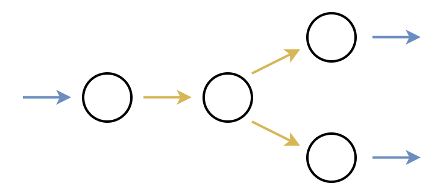

# Lichee-Cluster

This is a repository of an edge computing heterogeneous node composed by Lichee Pi and Lichee Tang series.

## System Architecture

To offer higher bandwidth on a limited number of pins, 16 pins are connected between each pair of adjacent physical nodes, which can be configured as a self-defined parallel data bus or an asynchronous FIFO, etc. The topology is shown below.

The user can customize the logical topology of the system in the FPGA program, that is, the input and output functions of each interconnecting pin. Note that our system architecture only supports bare metal topologies where each node has a degree of 2 or less. For example, the supported logical topologies is shown blow.

And the logical topologies NOT supported is shown below, for example.

## Programming Template

We provide a programming template to accelerate deployment. In this template, nodes communicate each other using asynchronous FIFO and transmit data to host using SPI protocol. The work flow is shown below.

## Reference

[Tang Nano - Sipeed Wiki](https://wiki.sipeed.com/hardware/zh/tang/Tang-Nano/Nano.html)

[Tang Primer - Sipeed Wiki](https://wiki.sipeed.com/hardware/zh/tang/Tang-primer/Tang-primer.html)

[Lichee Zero - Sipeed Wiki](https://wiki.sipeed.com/hardware/zh/lichee/Zero/Zero.html)
